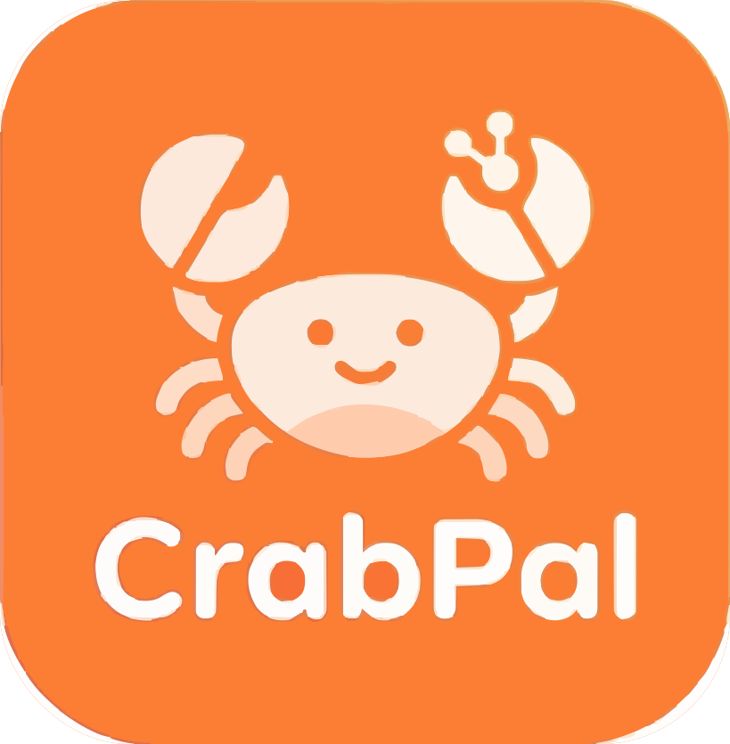

<div align="center">



# CrabPal

### Your agent‑native desktop workspace — friendly as a pal, quick as a crab.

[](LICENSE)
[](CODE_OF_CONDUCT.md)
[](#installation)
[](https://bun.sh/)
[](https://www.typescriptlang.org/)


</div>

---

## Table of Contents

- [What is CrabPal?](#what-is-crabpal)
- [Highlights](#highlights)
- [Installation](#installation)
- [Quick Start](#quick-start)
- [Key Features](#key-features)
- [LLM Providers](#llm-providers)
- [Remote Server (Headless)](#remote-server-headless)
- [CLI Client](#cli-client)
- [Configuration](#configuration)
- [Automations](#automations)
- [Architecture](#architecture)
- [Development](#development)
- [Troubleshooting](#troubleshooting)
- [Contributing](#contributing)
- [Security](#security)
- [License](#license)
- [Credits &amp; Upstream Attribution](#credits--upstream-attribution)
- [Trademarks](#trademarks)

---

## What is CrabPal?

**CrabPal is a friendly desktop home for working with AI agents.** Think of it as a real workspace — with an inbox of sessions, skills you can teach, sources you can plug in, and automations that quietly do work in the background — instead of a single chat window in a terminal.

Under the hood, CrabPal runs two first‑class agent backends side by side so you can pick the right tool for the job:

- The **[Claude Agent SDK](https://www.npmjs.com/package/@anthropic-ai/claude-agent-sdk)** — Anthropic API keys, Claude Max / Pro OAuth, and any Anthropic‑compatible endpoint (OpenRouter, Vercel AI Gateway, Ollama, custom).
- The **Pi SDK** — Google AI Studio, ChatGPT Plus (Codex OAuth), GitHub Copilot OAuth, and direct OpenAI API keys.

Everything you see — skills, sources, themes, statuses, permissions, automations — is user‑editable and lives in plain files on disk. CrabPal is open source under the **Apache License 2.0**, so you are free to use, fork, remix, and ship it (including commercially).

> CrabPal is a community fork of **[Craft Agents](https://github.com/lukilabs/craft-agents-oss)** by Craft Docs Ltd. See [Credits &amp; Upstream Attribution](#credits--upstream-attribution).

## Highlights

- **A real inbox, not a chat window** — multiple concurrent sessions with statuses, labels, flags, and AI‑generated titles.
- **Plug‑and‑play integrations** — say *"add Linear as a source"* and CrabPal discovers APIs/MCP servers, reads their docs, and wires up auth.
- **Universal connectivity** — any MCP server (stdio or HTTP), any REST API, and your local filesystem.
- **Multi‑provider by design** — Anthropic, Google, OpenAI, Copilot, ChatGPT Plus, OpenRouter, Vercel AI Gateway, Ollama, or any compatible endpoint.
- **Skills** — reusable, per‑workspace agent playbooks. Import directly from Claude Code.
- **Safe by default** — three‑tier permission model (**Explore → Ask → Execute**) with customizable rules.
- **Automations** — event‑driven triggers (labels, cron, tool use, session events) that run prompts for you.
- **Headless server + thin client** — run long sessions on a VPS, connect from anywhere.
- **Rich output** — Mermaid diagrams, sortable data tables, spreadsheets, HTML/PDF/image previews, unified code diffs.

## Installation

### One‑line install (recommended)

**macOS / Linux**

```bash
curl -fsSL https://crabpal.app/install-app.sh | bash
```

**Windows (PowerShell)**

```powershell
irm https://crabpal.app/install-app.ps1 | iex
```

### Build from source

Requirements: [Bun](https://bun.sh/) ≥ 1.x, Node.js 18+ (for some tooling), and a supported desktop OS.

```bash
git clone <your-crabpal-fork-url> crabpal
cd crabpal
bun install
bun run electron:start
```

For development with hot reload:

```bash
bun run electron:dev
```

## Quick Start

1. **Launch the app** after installation.
2. **Connect an LLM provider** — Anthropic (API key or Claude Max/Pro OAuth), Google AI Studio, ChatGPT Plus, GitHub Copilot, or any third‑party endpoint.
3. **Create a workspace** to group your sessions and sources.
4. *(Optional)* **Add a source** — MCP server, REST API, or local folder. Just describe it to the agent.
5. **Start a session** and chat. Use `SHIFT+TAB` to cycle permission modes and `@` to mention sources or skills.

## Key Features

### Session management

- Inbox/Archive organized by workflow status
- Custom statuses (Todo → In Progress → Needs Review → Done, fully configurable)
- Flagging, labels, and AI‑generated session titles
- Full conversation history persisted to disk (JSONL)
- Multi‑file diff viewer (VS Code–style) for all changes in a turn

### Sources (external data connections)

| Type                  | Examples                                                              |
| --------------------- | --------------------------------------------------------------------- |
| **MCP servers** | GitHub, Linear, Notion, and any custom stdio / HTTP MCP server        |
| **REST APIs**   | Gmail, Calendar, Drive, YouTube, Search Console, Slack, Microsoft 365 |
| **Local**       | Filesystems, Obsidian vaults, git repositories                        |

### Permission modes

| Mode          | Display               | Behavior                                 |
| ------------- | --------------------- | ---------------------------------------- |
| `safe`      | **Explore**     | Read‑only; blocks all write operations  |
| `ask`       | **Ask to Edit** | Prompts for approval on writes (default) |
| `allow-all` | **Execute**     | Auto‑approves all commands              |

Cycle modes at any time with **`SHIFT+TAB`**.

### Keyboard shortcuts

| Shortcut                    | Action                      |
| --------------------------- | --------------------------- |
| `Cmd+N`                   | New chat                    |
| `Cmd+1/2/3`               | Focus sidebar / list / chat |
| `Cmd+/`                   | Keyboard shortcuts dialog   |
| `SHIFT+TAB`               | Cycle permission modes      |
| `Enter` / `Shift+Enter` | Send message / new line     |

### Skills

Specialized agent instructions stored per workspace. Create one with a natural‑language description, or import your existing Claude Code skills in one go.

### Rich output

CrabPal natively renders inside chat:

- **Mermaid diagrams** — flowcharts, sequence, state, ER, class, XY charts
- **Data tables & spreadsheets** — sortable, filterable, exportable
- **HTML / PDF / image previews** — including tabbed multi‑item previews
- **Code diffs** — unified diff view for AI‑proposed changes
- **File attachments** — drag‑drop images, PDFs, Office docs with auto‑conversion

## LLM Providers

CrabPal supports two complementary backends so you can use whichever model and subscription suits the task.

### Direct connections

| Provider                     | Auth                            | Notes                                                                |
| ---------------------------- | ------------------------------- | -------------------------------------------------------------------- |
| **Anthropic**          | API key or Claude Max/Pro OAuth | Direct Claude via the Claude Agent SDK                               |
| **Google AI Studio**   | API key                         | Gemini models with native Google Search grounding                    |
| **ChatGPT Plus / Pro** | Codex OAuth                     | Sign in with your ChatGPT subscription — uses OpenAI's Codex models |
| **GitHub Copilot**     | OAuth (device code)             | One‑click auth with your Copilot subscription                       |

### Third‑party & self‑hosted (via the Anthropic connection with a custom endpoint)

| Provider                    | Endpoint                         | Notes                                                              |
| --------------------------- | -------------------------------- | ------------------------------------------------------------------ |
| **OpenRouter**        | `https://openrouter.ai/api`    | Claude, GPT, Llama, Gemini, and hundreds more through a single key |
| **Vercel AI Gateway** | `https://ai-gateway.vercel.sh` | Observability and caching in front of your provider                |
| **Ollama**            | `http://localhost:11434`       | Run open‑source models locally. No API key required               |
| **Custom**            | Any URL                          | Any OpenAI‑ or Anthropic‑compatible endpoint                     |

## Remote Server (Headless)

CrabPal can run as a headless WebSocket server on a remote machine (e.g. a Linux VPS) while the desktop app (or CLI) connects as a thin client.

### Start a server

```bash
CRAB_PAL_SERVER_TOKEN=$(openssl rand -hex 32) bun run packages/server/src/index.ts
```

The server prints its connection details on startup:

```
CRAB_PAL_SERVER_URL=ws://203.0.113.5:9100
CRAB_PAL_SERVER_TOKEN=<generated-token>
```

### Connect the desktop app

```bash
CRAB_PAL_SERVER_URL=wss://203.0.113.5:9100 \
CRAB_PAL_SERVER_TOKEN=<token> \
bun run electron:start
```

In thin‑client mode the UI renders locally while all session logic, tool execution, and LLM calls run on the remote server.

### Environment variables

| Variable               | Required | Default       | Description                                                   |
| ---------------------- | -------- | ------------- | ------------------------------------------------------------- |
| `CRAB_PAL_SERVER_TOKEN` | Yes      | —            | Bearer token for client authentication                        |
| `CRAB_PAL_RPC_HOST`     | No       | `127.0.0.1` | Bind address (`0.0.0.0` for remote access)                  |
| `CRAB_PAL_RPC_PORT`     | No       | `9100`      | Bind port                                                     |
| `CRAB_PAL_RPC_TLS_CERT` | No       | —            | Path to PEM certificate file (enables `wss://`)             |
| `CRAB_PAL_RPC_TLS_KEY`  | No       | —            | Path to PEM private key file (required with cert)             |
| `CRAB_PAL_RPC_TLS_CA`   | No       | —            | Path to PEM CA chain (optional, for client cert verification) |
| `CRAB_PAL_DEBUG`        | No       | `false`     | Enable debug logging                                          |

### TLS (recommended for remote access)

Generate a self‑signed cert for development:

```bash
./scripts/generate-dev-cert.sh
```

Then start the server with TLS:

```bash
CRAB_PAL_SERVER_TOKEN=<token> \
CRAB_PAL_RPC_HOST=0.0.0.0 \
CRAB_PAL_RPC_TLS_CERT=certs/cert.pem \
CRAB_PAL_RPC_TLS_KEY=certs/key.pem \
bun run packages/server/src/index.ts
```

For production, use certificates from a trusted CA (e.g. Let's Encrypt) or terminate TLS at a reverse proxy (nginx, Caddy).

### Docker

```bash
docker run -d \
  -p 9100:9100 \
  -e CRAB_PAL_SERVER_TOKEN=<token> \
  -e CRAB_PAL_RPC_HOST=0.0.0.0 \
  -v crabpal-data:/root/.crabpal \
  crabpal-server
```

## CLI Client

A terminal client that connects to a running CrabPal server over WebSocket (`ws://` or `wss://`). Ideal for scripting, CI/CD, server validation, or when you simply prefer the shell.

### Setup

```bash
# From the monorepo (requires Bun)
bun run apps/cli/src/index.ts --help

# Or add to your PATH
alias crabpal="bun run $(pwd)/apps/cli/src/index.ts"
```

### Connection

```bash
export CRAB_PAL_SERVER_URL=ws://127.0.0.1:9100
export CRAB_PAL_SERVER_TOKEN=<your-token>
crabpal ping
```

For TLS connections use `--tls-ca <path>` when working with self‑signed certificates.

### Commands

| Command                     | Description                                                      |
| --------------------------- | ---------------------------------------------------------------- |
| `ping`                    | Verify connectivity (clientId + latency)                         |
| `health`                  | Check credential store health                                    |
| `versions`                | Show server runtime versions                                     |
| `workspaces`              | List workspaces                                                  |
| `sessions`                | List sessions in workspace                                       |
| `connections`             | List LLM connections                                             |
| `sources`                 | List configured sources                                          |
| `session create`          | Create a session (`--name`, `--mode`)                        |
| `session messages <id>`   | Print session message history                                    |
| `session delete <id>`     | Delete a session                                                 |
| `send <id> <message>`     | Send message and stream AI response                              |
| `cancel <id>`             | Cancel in‑progress processing                                   |
| `invoke <channel> [args]` | Raw RPC call with JSON args                                      |
| `listen <channel>`        | Subscribe to push events (Ctrl+C to stop)                        |
| `run <prompt>`            | Self‑contained: spawn server, run prompt, stream response, exit |
| `--validate-server`       | 21‑step integration test (auto‑spawns server if no `--url`)  |

### `run` flags

| Flag                       | Default            | Description                                                                               |
| -------------------------- | ------------------ | ----------------------------------------------------------------------------------------- |
| `--workspace-dir <path>` | —                 | Register a workspace directory before running                                             |
| `--source <slug>`        | —                 | Enable a source (repeatable)                                                              |
| `--output-format <fmt>`  | `text`           | `text` or `stream-json`                                                               |
| `--mode <mode>`          | `allow-all`      | Permission mode for the session                                                           |
| `--no-cleanup`           | `false`          | Skip session deletion on exit                                                             |
| `--server-entry <path>`  | —                 | Custom server entry point                                                                 |
| `--provider <name>`      | `anthropic`      | `anthropic`, `openai`, `google`, `openrouter`, `groq`, `mistral`, `xai`, … |
| `--model <id>`           | (provider default) | Model ID (e.g.`claude-sonnet-4-5-20250929`, `gpt-4o`, `gemini-2.0-flash`)           |
| `--api-key <key>`        | —                 | API key (or `$LLM_API_KEY`, or a provider‑specific env var)                            |
| `--base-url <url>`       | —                 | Custom API endpoint for proxies or self‑hosted models                                    |

### Examples

```bash
# Quick connectivity check
crabpal ping

# Send a message and stream the response
crabpal send abc-123 "What files are in the current directory?"

# JSON output for scripting
crabpal --json workspaces | jq '.[].name'

# Self‑contained run (spawns its own server)
crabpal run "Summarize the README"
crabpal run --workspace-dir ./my-project --source github "List open PRs"

# Multi‑provider
crabpal run --provider openai --model gpt-4o "Summarize this repo"
GOOGLE_API_KEY=... crabpal run --provider google --model gemini-2.0-flash "Hello"

# Validate the server (auto‑spawns if no --url)
crabpal --validate-server
```

## Configuration

All user data lives under `~/.crabpal/`:

```
~/.crabpal/
├── config.json              # Main config (workspaces, LLM connections)
├── credentials.enc          # Encrypted credentials (AES‑256‑GCM)
├── preferences.json         # User preferences
├── theme.json               # App‑level theme
└── workspaces/
    └── {id}/
        ├── config.json      # Workspace settings
        ├── theme.json       # Workspace theme override
        ├── automations.json # Event‑driven automations
        ├── sessions/        # Session data (JSONL)
        ├── sources/         # Connected sources
        ├── skills/          # Custom skills
        └── statuses/        # Status configuration
```

### Google OAuth (Gmail, Calendar, Drive, YouTube, Search Console)

Google integrations require you to create your own OAuth credentials — a one‑time setup.

1. In the [Google Cloud Console](https://console.cloud.google.com), create a project.
2. Enable the APIs you need (Gmail, Calendar, Drive, …).
3. Configure the **OAuth consent screen** (External unless you have Google Workspace). Add yourself as a test user.
4. Create OAuth credentials with **Application type: Desktop app** and copy the Client ID and Client Secret.
5. Provide them when setting up your Google source (or let the agent guide you):

```json
{
  "api": {
    "googleService": "gmail",
    "googleOAuthClientId": "your-client-id.apps.googleusercontent.com",
    "googleOAuthClientSecret": "your-client-secret"
  }
}
```

Credentials are stored encrypted alongside other source credentials. Never commit them to version control.

### Deep linking

External apps can navigate CrabPal via `crabpal://` URLs:

```
crabpal://allSessions                      # All sessions view
crabpal://allSessions/session/session123   # Specific session
crabpal://settings                         # Settings
crabpal://sources/source/github            # Source info
crabpal://action/new-chat                  # Create a new session
```

## Automations

Automations trigger actions when events happen — labels change, sessions start, tools run, or on a cron schedule. The simplest way is to just ask the agent:

- *"Set up a daily standup briefing every weekday at 9am"*
- *"Notify me when a session is labelled urgent"*
- *"Every Friday at 5pm, summarise this week's completed tasks"*

Or configure manually in `~/.crabpal/workspaces/{id}/automations.json`:

```json
{
  "version": 2,
  "automations": {
    "SchedulerTick": [
      {
        "cron": "0 9 * * 1-5",
        "timezone": "America/New_York",
        "labels": ["Scheduled"],
        "actions": [
          { "type": "prompt", "prompt": "Check @github for new issues assigned to me" }
        ]
      }
    ],
    "LabelAdd": [
      {
        "matcher": "^urgent$",
        "actions": [
          { "type": "prompt", "prompt": "An urgent label was added. Triage the session and summarise what needs attention." }
        ]
      }
    ]
  }
}
```

Prompt actions support `@mentions` for sources and skills. Environment variables such as `$CRAB_PAL_LABEL` and `$CRAB_PAL_SESSION_ID` are expanded automatically.

**Supported events:** `LabelAdd`, `LabelRemove`, `PermissionModeChange`, `FlagChange`, `SessionStatusChange`, `SchedulerTick`, `PreToolUse`, `PostToolUse`, `SessionStart`, `SessionEnd`, and more.

## Architecture

```
crabpal/
├── apps/
│   ├── cli/                   # Terminal client
│   ├── electron/              # Desktop GUI (primary interface)
│   │   └── src/
│   │       ├── main/          # Electron main process
│   │       ├── preload/       # Context bridge
│   │       └── renderer/      # React UI (Vite + shadcn)
│   ├── viewer/                # Shared session viewer
│   └── webui/                 # Browser‑based UI
└── packages/
    ├── core/                  # @crabpal/core — shared types
    ├── server/                # @crabpal/server — headless server entry
    ├── shared/                # @crabpal/shared — business logic
    │   └── src/
    │       ├── agent/         # Agent loop, permissions
    │       ├── auth/          # OAuth, tokens
    │       ├── config/        # Storage, preferences, themes
    │       ├── credentials/   # AES‑256‑GCM encrypted storage
    │       ├── sessions/      # Session persistence
    │       ├── sources/       # MCP, REST, local sources
    │       └── statuses/      # Dynamic status system
    └── ui/                    # @crabpal/ui — React components
```

### Tech stack

| Layer               | Technology                                                                                  |
| ------------------- | ------------------------------------------------------------------------------------------- |
| Runtime             | [Bun](https://bun.sh/)                                                                         |
| AI (Claude backend) | [@anthropic-ai/claude-agent-sdk](https://www.npmjs.com/package/@anthropic-ai/claude-agent-sdk) |
| AI (Pi backend)     | Pi SDK agent server                                                                         |
| Desktop             | [Electron](https://www.electronjs.org/) + React 18                                             |
| UI                  | [shadcn/ui](https://ui.shadcn.com/) + Tailwind CSS v4                                          |
| Build               | esbuild (main) + Vite (renderer)                                                            |
| Credentials         | AES‑256‑GCM encrypted file storage                                                        |

## Development

```bash
# Hot‑reload development
bun run electron:dev

# Build and run once
bun run electron:start

# Type‑check the whole monorepo
bun run typecheck:all

# Lint
bun run lint
```

Logs (development and debug builds) are written to:

- **macOS:** `~/Library/Logs/@crabpal/electron/main.log`
- **Windows:** `%APPDATA%\@crabpal\electron\logs\main.log`
- **Linux:** `~/.config/@crabpal/electron/logs/main.log`

### Environment variables

OAuth integrations for Slack and Microsoft need credentials baked into the build. Copy `.env.example` to `.env` and fill in:

```bash
MICROSOFT_OAUTH_CLIENT_ID=your-client-id
SLACK_OAUTH_CLIENT_ID=your-slack-client-id
SLACK_OAUTH_CLIENT_SECRET=your-slack-client-secret
```

Google OAuth credentials are **not** baked into the build — users provide their own at source‑setup time.

## Troubleshooting

### Debug mode for the packaged app

Launch with `-- --debug` (note the double‑dash separator):

**macOS**

```bash
/Applications/CrabPal.app/Contents/MacOS/CrabPal -- --debug
```

**Windows (PowerShell)**

```powershell
& "$env:LOCALAPPDATA\Programs\CrabPal\CrabPal.exe" -- --debug
```

**Linux**

```bash
./crabpal -- --debug
```

### Large tool responses

Tool results exceeding ~60 KB are automatically summarized using Claude Haiku with intent‑aware context. The `_intent` field is injected into MCP tool schemas to preserve summarization focus.

## Contributing

Contributions are welcome! Please read:

- [CONTRIBUTING.md](CONTRIBUTING.md) — setup, branching, PR flow
- [CODE_OF_CONDUCT.md](CODE_OF_CONDUCT.md) — Contributor Covenant 2.1
- [SECURITY.md](SECURITY.md) — responsible disclosure

By contributing, you agree that your contributions will be licensed under the Apache License 2.0.

## Security

### Reporting vulnerabilities

**Please do not report security issues through public GitHub issues.** Email `security@crabpal.app` with a description, reproduction steps, and potential impact. Full policy: [SECURITY.md](SECURITY.md).

### Local MCP server isolation

When CrabPal spawns local stdio MCP servers, it filters sensitive environment variables out of the subprocess environment to prevent credential leakage. Blocked variables include:

- `ANTHROPIC_API_KEY`, `CLAUDE_CODE_OAUTH_TOKEN`
- `AWS_ACCESS_KEY_ID`, `AWS_SECRET_ACCESS_KEY`, `AWS_SESSION_TOKEN`
- `GITHUB_TOKEN`, `GH_TOKEN`, `OPENAI_API_KEY`, `GOOGLE_API_KEY`, `STRIPE_SECRET_KEY`, `NPM_TOKEN`

To explicitly pass an env var to a specific MCP server, declare it in the `env` field of that source's config.

## License

CrabPal is licensed under the **Apache License 2.0** — see the [LICENSE](LICENSE) file for the full text.

You are free to use, modify, and distribute the software — including for commercial purposes — subject to the terms of the license. The Apache 2.0 license requires you to retain copyright notices and the [NOTICE](NOTICE) file in distributions of this software.

### Third‑party licenses

CrabPal bundles and/or uses the following notable third‑party software, each under its own license:

- **[Claude Agent SDK](https://www.npmjs.com/package/@anthropic-ai/claude-agent-sdk)** — subject to [Anthropic&#39;s Commercial Terms of Service](https://www.anthropic.com/legal/commercial-terms).
- **Pi SDK** (`@mariozechner/pi-ai`, `@mariozechner/pi-coding-agent`) — see the packages' respective licenses.
- **Electron, React, Tailwind, shadcn/ui, Radix UI, TipTap, Shiki, Mermaid, and other dependencies** — see their respective licenses in `node_modules` and `package.json`.

## Credits & Upstream Attribution

CrabPal is a community fork of **[Craft Agents](https://github.com/lukilabs/craft-agents-oss)**, originally developed and maintained by **[Craft Docs Ltd.](https://craft.do)** under the Apache License 2.0.

As required by the Apache 2.0 license, the original [NOTICE](NOTICE) is preserved in this repository:

> CrabPal is based on Craft Agents and includes software originally developed by Craft Docs Ltd. — https://craft.do

We are grateful to the Craft team for open‑sourcing their work. CrabPal continues in the spirit of that project while taking its own direction; issues, pull requests, and design decisions here are independent of the upstream project, and any bugs in this fork should be reported here — not to Craft.

## Trademarks

**Craft**, **Craft Agents**, and their associated logos are trademarks of **Craft Docs Ltd.** They are used here **only** to accurately describe CrabPal's relationship to the upstream project (*"fork of Craft Agents"*, *"based on Craft Agents"*), as permitted by the upstream [Trademark Policy](TRADEMARK.md).

CrabPal:

- is **not** an official product of, and is **not** endorsed by, Craft Docs Ltd.
- does **not** use the Craft or Craft Agents name as its product name.
- does **not** use Craft logos or icons as its application icon or branding.
- uses a distinct bundle identifier and its own visual identity.

If you fork CrabPal or Craft Agents yourself, please read [TRADEMARK.md](TRADEMARK.md) before redistributing. For trademark questions, contact `legal@craft.do`.

---

<div align="center">

Made with love by the CrabPal community · Based on `<a href="https://github.com/lukilabs/craft-agents-oss">`Craft Agents`</a>` · Licensed under `<a href="LICENSE">`Apache 2.0`</a>`

</div>
